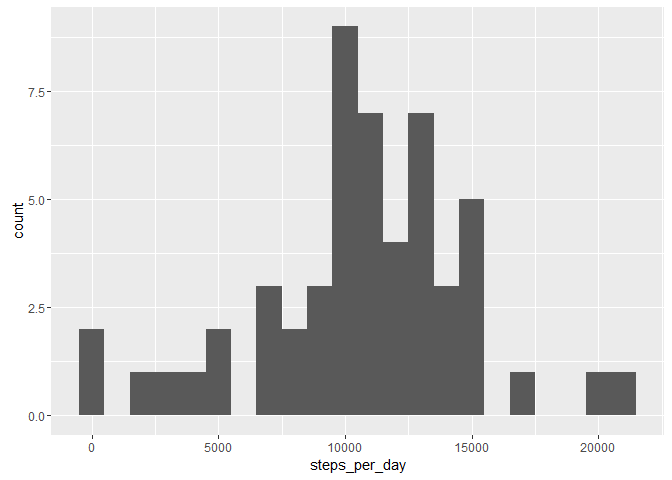
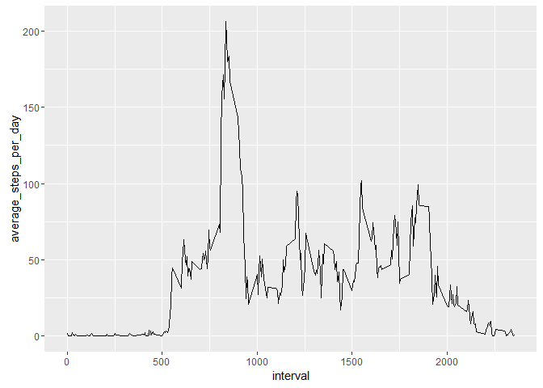
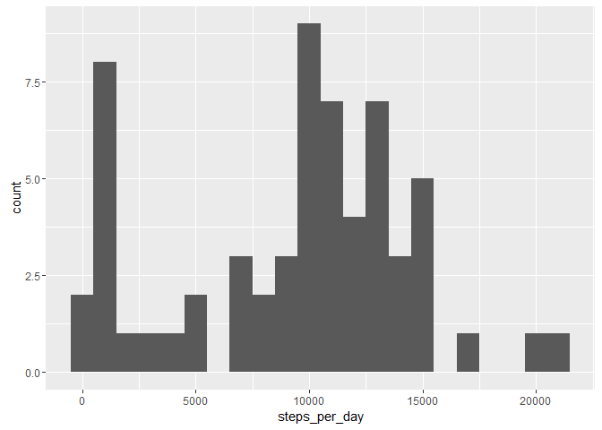
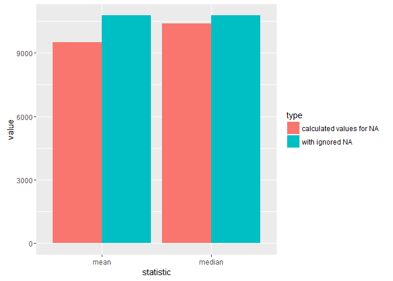
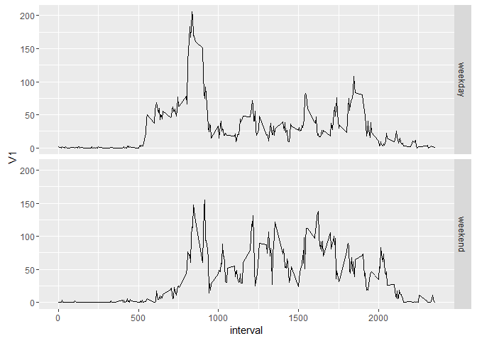

# Reproducible Research: Peer Assessment 1


## Loading and preprocessing the data
### 1) Code for reading in the dataset and/or processing the data

```r
    library(data.table)

    srcFile = "https://d396qusza40orc.cloudfront.net/repdata%2Fdata%2Factivity.zip"
    targetFile = "activity.zip"
    
    if(!file.exists(targetFile)) {
        download.file(srcFile,targetFile) 
        unzip(targetFile)
    }
    
    activity <- fread("activity.csv",na.strings = "NA", sep = ",")
    activity$date <- as.Date(activity$date)
```
## What is mean total number of steps taken per day?
### 2) Histogram of the total number of steps taken each day

```r
    library(ggplot2)

    total_per_day <- activity[!is.na(steps), sum(steps), by="date"]
    names(total_per_day) <- c("date","steps_per_day")
    qplot(steps_per_day, data = total_per_day, binwidth = 1000)
```



### 3) Mean and median number of steps taken each day

```r
    paste("mean: ",mean(total_per_day$steps_per_day))
```

```
## [1] "mean:  10766.1886792453"
```

```r
    paste("median: ",median(total_per_day$steps_per_day))
```

```
## [1] "median:  10765"
```


## What is the average daily activity pattern?
### 4) Time series plot of the average number of steps taken

```r
    average_per_interval <- activity[!is.na(steps), mean(steps), by="interval"]
    names(average_per_interval) <- c("interval","average_steps_per_day")
    qplot(interval,average_steps_per_day, data=average_per_interval, geom="line")
```



### 5) The 5-minute interval that, on average, contains the maximum number of steps

```r
    average_per_interval[average_steps_per_day == max(average_steps_per_day)]
```

```
##    interval average_steps_per_day
## 1:      835              206.1698
```

## Imputing missing values

#### Number of missing values

```r
    paste("missing values: ",sum(is.na(activity$steps)))
```

```
## [1] "missing values:  2304"
```

### 6) Code to describe and show a strategy for imputing missing data
I use median for setting missing Value because it "ignores" outlier.

```r
    median_per_interval <- activity[!is.na(steps), median(steps), by="interval"]

    for(i in 1:nrow(activity)){
        if(is.na(activity[i]$steps)){
            activity[i]$steps = median_per_interval[interval==activity[i]$interval]$V1
        }
    }
```
### 7) Histogram of the total number of steps taken each day after missing values are imputed


```r
    total_per_day_no_na <- activity[, sum(steps), by="date"]
    names(total_per_day_no_na) <- c("date","steps_per_day")
    qplot(steps_per_day, data = total_per_day_no_na, binwidth = 1000)
```


#### What is mean total number of steps taken per day with calculated missing values?

```r
    paste("mean: ",mean(total_per_day_no_na$steps_per_day))
```

```
## [1] "mean:  9503.86885245902"
```

```r
    paste("median: ",median(total_per_day_no_na$steps_per_day))
```

```
## [1] "median:  10395"
```
#### What is the impact of imputing missing data on the estimates of the total daily number of steps?

```r
mean_na <- mean(total_per_day$steps_per_day)
mean_no_na <- mean(total_per_day_no_na$steps_per_day)
median_na <- median(total_per_day$steps_per_day)
median_no_na <- median(total_per_day_no_na$steps_per_day)


diff <- data.frame(statistic=c("mean","mean","median","median"),
                   type = c("with ignored NA","calculated values for NA","with ignored NA","calculated values for NA"),
                   value=c(mean_na,mean_no_na,median_na,median_no_na))

ggplot(data=diff, aes(x=statistic, y=value, fill=type)) +
    geom_bar(stat="identity", position=position_dodge())
```



```r
paste("mean decreased by: ",mean_na-mean_no_na)
```

```
## [1] "mean decreased by:  1262.31982678627"
```

```r
paste("median decreased by: ",median_na-median_no_na)
```

```
## [1] "median decreased by:  370"
```
## Are there differences in activity patterns between weekdays and weekends?
#### Set factor for weekday/weekend

```r
activity$weektype <- factor(
                        sapply(weekdays(activity$date),
                               function(day){ 
                                   if(day == "Sonntag" || day == "Samstag") 
                                       "weekend" 
                                   else "weekday" 
                                }
                               )
                            )
```
### 8) Panel plot comparing the average number of steps taken per 5-minute interval across weekdays and weekends

```r
average_per_interval_weektype <- activity[, mean(steps), by=c("interval","weektype")]

qplot(interval, V1, data = average_per_interval_weektype, geom=c("line"), facets = weektype ~ .)
```


